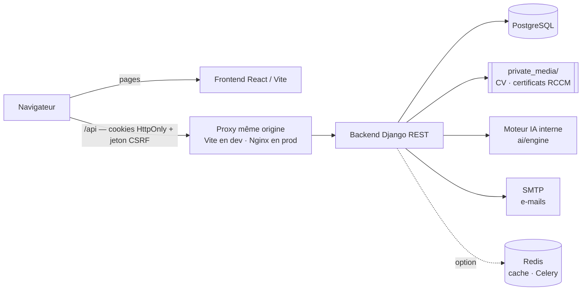

# TafLocal IA — Rapport d'audit, corrections et fonctionnement

Ce document est la référence du projet. Il décrit :

- **Partie A — le fonctionnement complet de l'application** (rôles, parcours,
  moteur IA, données, sécurité, API, configuration, déploiement) ;
- **Partie B — l'historique des audits et des corrections** : phase 1
  (remise en état de l'application) puis phase 2 (refonte de l'interface,
  nouvelles fonctionnalités, second audit de sécurité) ;
- **Partie C — les limites connues et les suites possibles.**

Il complète le document `TafLocal-IA_Audit_Roadmap.docx`.

## État vérifié au 24/09/2026

| Contrôle | Résultat |
|---|---|
| Tests automatisés backend (`pytest`) | **190 tests, tous réussis** (66 à la fin de la phase 1) |
| Contrôle Django (`manage.py check`) | aucun problème |
| Contrôle de production (`manage.py check --deploy`) | 1 seul avertissement, facultatif (préchargement HSTS) |
| Vulnérabilités des dépendances Python (`pip-audit`) | **0** (88 corrigées en phase 2) |
| Vulnérabilités des dépendances JavaScript (`npm audit`) | **0** |
| Frontend : TypeScript, `eslint`, `vite build` | aucune erreur |
| Démarrage | aucun service externe requis (IA interne ; e-mails affichés dans le terminal si SMTP non configuré) |

---

## Sommaire

- **Partie A — Fonctionnement**
  A1 Présentation et rôles · A2 Architecture · A3 Parcours candidat ·
  A4 Parcours entreprise · A5 Parcours administrateur · A6 Moteur IA ·
  A7 Données et fichiers · A8 Sécurité · A9 API · A10 Interface ·
  A11 Configuration · A12 Installation, lancement, tests · A13 Mise en production
- **Partie B — Audits et corrections**
  B1 à B5 : phase 1 · B6 à B10 : phase 2
- **Partie C — Limites connues et suites**

---

# Partie A — Fonctionnement de l'application

## A1. Présentation et rôles

TafLocal IA est une plateforme d'emploi qui met en relation **candidats** et
**entreprises**, assistée par une **intelligence artificielle interne**
(aucune API externe, aucune donnée envoyée à un tiers).

| Rôle | Ce qu'il peut faire |
|---|---|
| **Candidat** | Créer son profil (aidé par l'IA à partir du CV), faire analyser son CV, recevoir des offres classées par compatibilité, postuler (CV obligatoire + lettre selon l'offre), suivre ses candidatures, s'entraîner aux entretiens, recevoir des notifications. |
| **Entreprise / recruteur** | S'inscrire avec son **RCCM** et le **certificat PDF**, attendre la validation d'un administrateur, puis publier des offres (en choisissant les pièces demandées), consulter les candidatures classées par l'IA, télécharger les CV reçus, faire évoluer le statut des candidatures. |
| **Administrateur** | Vérifier et valider/rejeter les entreprises, consulter les statistiques de la plateforme et l'état du moteur IA, accéder à l'interface d'administration Django. |

Un visiteur ne peut s'inscrire que comme candidat ou entreprise : le rôle
administrateur se crée uniquement en ligne de commande (`createsuperuser`).

## A2. Architecture



| Couche | Technologies | Dossier |
|---|---|---|
| Frontend | React 19, TypeScript, Vite 8, Tailwind CSS 4, React Router 7, React Hook Form + Zod, Framer Motion | `frontend/` |
| Backend | Python 3.14, Django 5.2, Django REST Framework 3.17, SimpleJWT 5.5, drf-spectacular | `Backend/` |
| Base de données | PostgreSQL 17 (SQLite possible pour un essai : `DB_ENGINE=sqlite`) | `BD/` (scripts historiques) |
| IA | Python pur : `pypdf`, `python-docx`, algorithmes maison | `Backend/ai/engine/` |

Applications Django : `authentication` (connexion, cookies, mot de passe
oublié, verrouillage), `users` (candidats, compétences, expériences,
formations), `companies` (entreprises, vérification RCCM), `jobs` (offres),
`applications` (candidatures, lettres), `cv_analysis` (CV et analyses),
`interviews` (entretiens simulés), `notifications`, `ai` (moteur et services),
`common` (stockage privé, limitation de débit, journal d'audit, filtres).

**Principe clé :** l'interface appelle l'API sur la **même origine** (`/api`).
C'est ce qui permet des cookies de session `SameSite=Strict` (voir A8).

## A3. Parcours candidat

1. **Inscription** — « Créer un compte » → écran de choix *Je cherche un
   emploi / Je recrute* → formulaire candidat (prénom, nom, e-mail, mot de
   passe de 8 caractères minimum, non uniquement numérique). Le compte est
   connecté immédiatement.
2. **Analyse du CV** (`Analyse CV`) — dépôt PDF, DOCX, DOC ou TXT (5 Mo max,
   contenu réel vérifié). L'IA calcule un **score d'employabilité**, détecte
   compétences, points forts et faibles, compétences manquantes par rapport
   au marché, et propose des recommandations. Le CV peut être réanalysé,
   téléchargé ou supprimé (sauf s'il est joint à une candidature en cours).
3. **Profil** — informations personnelles, compétences, expériences,
   formations (diplôme ou certificat + établissement + **mois et année
   d'obtention**). Le panneau **« Suggestions de l'IA »** propose de compléter
   le profil à partir du dernier CV analysé (coordonnées, date de naissance,
   adresse, ville, présentation, compétences, expériences, formations).
   **Rien n'est enregistré sans validation explicite du candidat** : chaque
   proposition est décochée par défaut, modifiable, et une confirmation est
   demandée.
4. **Offres** — `Toutes les offres` (recherche, filtres en pastilles dont *Emploi / Stage*, tri) et
   `Offres recommandées` (classées par score de compatibilité avec
   explication). Le détail d'une offre montre la compatibilité, les
   compétences correspondantes/manquantes et les **pièces demandées**.
5. **Candidature** — le **CV est obligatoire** (choix parmi ses CV ou dépôt
   d'un nouveau sans quitter la page) ; la **lettre de motivation** est
   masquée, facultative ou obligatoire selon l'offre (100 caractères minimum
   si obligatoire), générable par l'IA. Confirmation, puis écran
   « Candidature envoyée ».
6. **Suivi** (`Mes candidatures`) — frise de progression (Envoyée → En examen
   → Présélectionnée → Retenue, ou Refusée/Retirée), retrait possible.
7. **Entretien IA** — **réservé aux offres auxquelles le candidat a postulé**
   (candidature non retirée ; vérifié par le serveur) : session de questions
   (RH, comportementales, techniques ciblées sur l'offre), évaluation de
   chaque réponse, synthèse finale. Le bouton « S'entraîner » n'apparaît sur
   une offre qu'après la candidature.
8. **Notifications** — nouvelles/déjà lues, compteur dans la barre du haut.
9. **Paramètres** — informations, notifications, changement de mot de passe,
   **mode sombre** (mémorisé), déconnexion.
10. **Mot de passe oublié** — lien sur l'écran de connexion → e-mail →
    **code à 6 chiffres** (15 min, 5 essais) → nouveau mot de passe →
    toutes les sessions ouvertes sont fermées.

## A4. Parcours entreprise

1. **Inscription** — choix *Je recrute* → formulaire entreprise : nom de
   l'entreprise, **numéro RCCM** (format vérifié, unique), **copie PDF du
   certificat RCCM** (vrai PDF, 5 Mo max), puis responsable du compte
   (prénom, nom, e-mail professionnel, mot de passe). Les administrateurs
   sont notifiés.
2. **Attente de vérification** — tant qu'un administrateur n'a pas validé
   l'entreprise, **le compte ne peut rien faire** : l'espace entreprise est
   remplacé par un écran de suivi (étapes, RCCM, certificat consultable,
   bouton « Actualiser le statut »). Côté serveur, toutes les routes sont
   refusées sauf la fiche, les notifications et la session.
3. **Rejet** — l'entreprise voit le **motif**, corrige son RCCM et/ou son
   certificat : le dossier repart automatiquement en vérification.
4. **Validation** — notification + e-mail ; l'espace complet se débloque.
5. **Offres** (`Gestion des offres`) — la création commence par le **choix du
   type d'offre** : *Offre d'emploi* ou *Offre de stage*. Pour un stage, la
   **durée (1 à 24 mois)** et le caractère **rémunéré ou non** sont
   obligatoires (gratification facultative si rémunéré ; le contrat est
   automatiquement « Stage »). Le type ne peut plus changer après la
   création. Formulaire : titre,
   description, exigences, compétences (suggestion automatique par l'IA),
   lieu, contrat, salaire, expérience, niveau d'études, date d'expiration,
   statut, et **pièces demandées** : CV (toujours obligatoire) + lettre de
   motivation *non demandée / facultative / obligatoire*.
6. **Candidatures reçues** — classement par **indice de compatibilité** (avec
   l'avertissement « indicatif, la décision appartient au recruteur ») ou par
   date, filtres, **téléchargement du CV transmis**, lecture de la lettre,
   changement de statut (le candidat est notifié).

Changer de RCCM ou de certificat après validation remet le compte **en
vérification**. Les offres d'une entreprise non validée ou révoquée sont
**invisibles** pour les candidats et ne reçoivent plus de candidatures.

## A5. Parcours administrateur

- **Vérification des entreprises** (tableau de bord Administration) : onglets
  En attente / Validées / Rejetées avec compteurs ; pour chaque dossier :
  contact, e-mail, date, RCCM (copiable), **certificat PDF** (« Voir le
  certificat »), boutons **Valider** et **Rejeter** (motif obligatoire,
  transmis à l'entreprise) ou **Révoquer** une entreprise validée.
- **Statistiques** : utilisateurs, offres publiées, candidatures, CV analysés,
  état du moteur IA.
- **Interface d'administration Django** : adresse configurable
  (`ADMIN_URL`) pour ne pas être devinable en production.

La vérification du RCCM est **humaine** : l'application contrôle la forme et
l'unicité du numéro, pas son existence au registre (pas d'API publique du
RCCM au Cameroun).

## A6. Moteur IA interne

Aucune API externe : tout est calculé localement, en Python.

| Module (`Backend/ai/engine/`) | Rôle |
|---|---|
| `text.py` | normalisation (accents), racinisation FR/EN, similarité cosinus |
| `skills.py` | référentiel d'environ 160 compétences avec synonymes et compétences proches |
| `cv_parser.py` | lecture PDF/DOCX/DOC/TXT, sections, coordonnées, années d'expérience, niveau d'études |
| `cv_analyzer.py` | score d'employabilité (5 critères), forces, faiblesses, compétences manquantes, recommandations |
| `matching.py` | score de compatibilité candidat ↔ offre (5 critères pondérés) + explication |
| `profile_extractor.py` | **suggestions de profil** : coordonnées, date de naissance, adresse, ville, présentation, expériences et formations structurées. Fonctionne sur les CV en colonnes (titres placés après leur contenu, dates coupées sur plusieurs lignes) grâce à une reconnaissance par le contenu de chaque ligne |
| `interview.py` | questions, évaluation des réponses (mots-clés, méthode STAR, exemples chiffrés), synthèse |
| `cover_letter.py` | lettre de motivation personnalisée |

La couche Django (`ai/services.py`) combine profil déclaré et CV, met les
scores en cache (`MatchResult`, invalidé automatiquement quand le profil, le
CV ou l'offre change) et crée les notifications. L'analyse peut être confiée
à Celery (`AI_USE_CELERY=True`) ; par défaut elle est immédiate.

## A7. Données et fichiers

| Modèle principal | Contenu |
|---|---|
| `User` | e-mail (identifiant), nom, prénom, téléphone, rôle |
| `CandidateProfile` + `CandidateSkill`, `WorkExperience`, `Education` | profil candidat ; une formation stocke sa date d'obtention dans `date_fin` |
| `Company` | fiche entreprise, `registre_commerce` (unique), `document_rccm` (PDF privé), `statut_verification` (PENDING / APPROVED / REJECTED), motif, date et auteur de la décision |
| `Job` | offre, `experience_requise_mois` (expérience en mois : 0, 3, 6 mois, 1 an…), `categorie` (EMPLOI / STAGE), `duree_stage_mois` et `stage_remunere` (stage uniquement), compétences requises (`Skill`), `lettre_motivation` (NON_DEMANDEE / FACULTATIVE / OBLIGATOIRE) |
| `Application` + `CoverLetter` | candidature, **CV transmis** (`cv`, protégé contre la suppression), statut, lettre |
| `CV`, `CVAnalysis`, `DetectedSkill`… | fichier du CV (privé), texte extrait, analyse |
| `PasswordResetCode` | codes de réinitialisation **hachés**, essais, expiration |
| `AuditLog` | journal des actions modifiantes (IP réelle, voir A8) |

**Fichiers.** Les CV et certificats RCCM sont des **données personnelles** :
ils sont rangés dans `Backend/private_media/` (jamais servi publiquement,
exclu de Git), sous un **nom aléatoire**. Ils ne sont lisibles que par des
routes qui contrôlent les droits (voir A9). `Backend/media/` n'est plus utilisé
pour ces fichiers.

**Sauvegardes** : la base PostgreSQL **et** le dossier `private_media/`.

## A8. Sécurité

### Authentification et session
- Jetons JWT dans des **cookies `HttpOnly`** (illisibles par JavaScript, donc
  impossibles à voler par une faille XSS), `SameSite=Strict`, `Secure` en
  HTTPS. Jeton d'accès : 15 min, limité au chemin `/api/` ; jeton de
  renouvellement : 1 jour, limité à `/api/auth/`, **rotation** à chaque
  usage et révocation de l'ancien.
- **Jeton anti-CSRF** obligatoire pour toute requête modifiante venant d'un
  navigateur (y compris connexion, inscription, déconnexion, mot de passe
  oublié) ; les requêtes d'un site tiers sont refusées.
- Les clients hors navigateur peuvent utiliser l'en-tête
  `Authorization: Bearer`.
- Au chargement, l'interface **demande au serveur** qui est connecté ; aucun
  jeton ni profil n'est stocké dans le navigateur.

### Anti force brute
- **Verrouillage de compte** : 5 échecs en 15 min → compte bloqué 15 min,
  même réponse que le compte existe ou non ; débloqué par une connexion
  réussie ou une réinitialisation du mot de passe.
- **Limitation par adresse IP** (connexion, inscription, mot de passe oublié,
  calculs IA). L'en-tête `X-Forwarded-For` n'est **pas** pris en compte sauf
  proxys de confiance déclarés (`NUM_PROXIES`) : impossible d'usurper une IP.
- Mot de passe oublié : code haché, 15 min, 5 essais, 60 s entre deux
  envois, réponse identique que le compte existe ou non.

### Contrôle d'accès
- Chaque rôle ne voit que ses données : un candidat ses CV et candidatures ;
  une entreprise **uniquement les CV joints aux candidatures reçues** ; un
  administrateur tout.
- Entreprises non validées bloquées **au niveau de l'authentification**
  (s'applique à toute route présente et future).
- Actions d'administration (liste de vérification, certificat, validation,
  rejet) réservées aux administrateurs.
- Rôle non modifiable par l'utilisateur ; inscription administrateur
  impossible.

### Fichiers
- Contrôle du **contenu réel** (signature du fichier) : un exécutable renommé
  en `.pdf` est refusé.
- Stockage privé, nom aléatoire, téléchargement avec en-têtes défensifs
  (`no-store`, `nosniff`, `Content-Security-Policy: sandbox`).

### Configuration et en-têtes
- En production (`DEBUG=False`) : HTTPS forcé, HSTS 1 an, cookies sécurisés,
  documentation de l'API réservée aux administrateurs, refus de démarrer si
  la clé secrète est faible ou `ALLOWED_HOSTS` ouvert à tous.
- En-têtes : `X-Frame-Options: DENY`, `nosniff`, `Referrer-Policy`,
  `Cross-Origin-Opener-Policy`.
- Taille des requêtes limitée ; dépendances sans vulnérabilité connue.

## A9. API

Documentation interactive : `/api/docs/` (Swagger) et `/api/redoc/` —
publique en développement, réservée aux administrateurs en production.

| Domaine | Routes principales |
|---|---|
| Session (`/api/auth/`) | `csrf/`, `login/`, `register/`, `token/refresh/`, `logout/`, `me/`, `profile/`, `change-password/`, `password-reset/request\|verify\|confirm/` (et l'ancien `reset-password/`) |
| Candidats (`/api/users/`) | `candidates/me/`, `candidates/me/cv-suggestions/` (lecture seule), `skills/`, `experiences/`, `formations/`, `me/`, `stats/` (admin) |
| Entreprises (`/api/companies/`) | `me/`, `me/document-rccm/`, `verification/` (admin), `{id}/approve/`, `{id}/reject/`, `{id}/document-rccm/` (admin) |
| Offres (`/api/jobs/`) | CRUD, `{id}/activate/`, `{id}/archive/`, `{id}/match/`, `{id}/applications/ranked/`, `match_for_me/` |
| Candidatures (`/api/applications/`) | liste/création (CV obligatoire), `{id}/` (statut), `{id}/withdraw/`, `ranked/` |
| CV (`/api/cv-analysis/`) | `cvs/` (dépôt, liste, suppression), `cvs/{id}/analyze/`, `cvs/{id}/download/`, `cvs/latest/`, `analyses/` |
| Entretiens (`/api/interviews/`) | `sessions/`, `sessions/{id}/start\|answer\|complete\|feedback/`, `questions/` |
| Notifications (`/api/notifications/`) | liste, `{id}/mark_read/`, `mark_all_read/`, `unread_count/` |
| IA (`/api/ai/`) | `health/`, `skills/`, `extract_skills/`, `match_job/`, `job_recommendations/`, `cover_letter/` |

## A10. Interface

- **Design** inspiré du kit *Jôbizz* : bleu acier `#356899`, marine, fonds
  pastel, police Poppins, formes arrondies, **mode clair et sombre**.
- **Logo rond** (emblème) + nom « TafLocal AI » ; icône d'onglet assortie.
- Navigation : barre du haut (recherche, notifications, avatar), menu latéral
  sur grand écran, **barre d'onglets en bas sur mobile**, tiroir de menu.
- 31 routes : publiques (accueil, connexion/inscription en deux étapes, mot
  de passe oublié), espace candidat, espace entreprise (protégé par la
  vérification), espace administrateur.

## A11. Configuration (`Backend/.env`)

| Variable | Rôle | Valeur par défaut |
|---|---|---|
| `SECRET_KEY` | clé de signature (≥ 50 caractères aléatoires en production) | obligatoire |
| `DEBUG` | mode développement | `False` |
| `ALLOWED_HOSTS`, `CORS_ALLOWED_ORIGINS`, `CSRF_TRUSTED_ORIGINS` | domaines autorisés | localhost |
| `DB_ENGINE`, `DB_NAME`, `DB_USER`, `DB_PASSWORD`, `DB_HOST`, `DB_PORT` | base de données | PostgreSQL local |
| `JWT_ACCESS_TOKEN_LIFETIME`, `JWT_REFRESH_TOKEN_LIFETIME` | durées des jetons (minutes) | 15 et 1440 (via `.env`) |
| `EMAIL_HOST`, `EMAIL_PORT`, `EMAIL_USE_TLS`/`SSL`, `EMAIL_HOST_USER`, `EMAIL_HOST_PASSWORD`, `DEFAULT_FROM_EMAIL` | envoi des e-mails ; sans `EMAIL_HOST`, les e-mails s'affichent dans le terminal | — |
| `PASSWORD_RESET_CODE_TTL_MINUTES`, `…_MAX_ATTEMPTS`, `…_RESEND_SECONDS` | mot de passe oublié | 15, 5, 60 |
| `LOGIN_MAX_FAILURES`, `LOGIN_FAILURE_WINDOW_MINUTES`, `LOGIN_LOCKOUT_MINUTES` | verrouillage de compte | 5, 15, 15 |
| `NUM_PROXIES` | proxys de confiance devant l'application | 0 |
| `ADMIN_URL` | adresse de l'administration Django | `admin/` |
| `API_DOCS_PUBLIC` | documentation de l'API publique | = `DEBUG` |
| `CACHE_REDIS_URL` | cache partagé (obligatoire avec plusieurs processus) | mémoire locale |
| `PRIVATE_MEDIA_ROOT`, `RCCM_MAX_UPLOAD_SIZE`, `CV_MAX_UPLOAD_SIZE` | fichiers privés et tailles | `private_media/`, 5 Mo |
| `AI_USE_CELERY`, `AI_THROTTLE_RATE`, `AI_MATCH_CACHE_TTL` | moteur IA | synchrone, 60/min, 3600 s |

Frontend (`frontend/.env`, voir `.env.example`) : `VITE_API_BASE_URL=/api`
(ne pas changer) et `VITE_API_PROXY_TARGET` (adresse du backend pour le proxy
de développement).

**Envoi réel des e-mails** : renseigner les variables `EMAIL_*` (Gmail avec un
*mot de passe d'application*, ou un service SMTP comme Brevo), redémarrer le
backend, puis tester avec `python manage.py sendtestemail adresse@exemple.com`.

## A12. Installation, lancement et tests

```bash
# Backend
cd Backend
python -m venv .venv
.venv\Scripts\python.exe -m pip install -r requirements.txt
.venv\Scripts\python.exe manage.py migrate
.venv\Scripts\python.exe manage.py createsuperuser      # compte administrateur
.venv\Scripts\python.exe manage.py seed_demo --password XXXX   # facultatif : données de démo
.venv\Scripts\python.exe manage.py runserver 8000

# Frontend (autre terminal)
cd frontend
npm install
npm run dev            # http://localhost:5173 (ou le port indiqué) ; /api est redirigé vers le backend
```

Tests et contrôles :

```bash
cd Backend && .venv\Scripts\python.exe -m pytest          # 190 tests
.venv\Scripts\python.exe -m pip_audit -r requirements.txt  # vulnérabilités Python
cd frontend && npx tsc -b && npm run lint && npm run build && npm audit
```

Le `.env` n'est lu qu'au démarrage : **redémarrer le backend** après toute
modification.

## A13. Mise en production (liste de contrôle)

- [ ] `DEBUG=False`, `SECRET_KEY` longue et aléatoire, `ALLOWED_HOSTS` précis.
- [ ] Interface et API sur le **même nom de domaine** (ex. `taflocal.cm` et
      `taflocal.cm/api/` via Nginx) — indispensable pour les cookies.
- [ ] HTTPS (certificat), `NUM_PROXIES=1` derrière Nginx, `BEHIND_PROXY=True`.
- [ ] `ADMIN_URL` non devinable, `CACHE_REDIS_URL` (Redis) si plusieurs processus.
- [ ] Mots de passe robustes (PostgreSQL, SMTP) ; SMTP configuré et testé.
- [ ] Politique de sécurité du contenu (CSP) sur les pages du frontend (Nginx).
- [ ] Sauvegardes chiffrées de PostgreSQL **et** de `private_media/`.
- [ ] `manage.py check --deploy`, `pytest`, `pip-audit`, `npm audit` au vert.

---

# Partie B — Audits et corrections

## Phase 1 — Remise en état de l'application

### B1. Suppression de Gemini et création d'une IA interne Django

**Avant.** `ai/services.py` appelait Google Gemini (`google-genai`) pour tout :
extraction de compétences, recommandations, questions d'entretien, feedback.
Problèmes :

- `from google import genai` au chargement du module, importé par
  `interviews/views.py` → **le serveur entier refusait de démarrer** si le
  paquet n'était pas installé (`ModuleNotFoundError`) ;
- sans `GEMINI_API_KEY`, chaque appel échouait et renvoyait un score par
  défaut de 50 — trompeur pour l'utilisateur ;
- un appel réseau par offre pour chaque recommandation (lent et coûteux) ;
- le code utilisait des champs qui n'existent pas (`job.title`,
  `job.requirements`, `job.skills_required`, `job.is_active`,
  `job.company.profile.company_name`, `candidate.experience_years`) : même
  avec une clé valide, la fonctionnalité était cassée ;
- l'upload de CV n'appelait jamais l'analyse : `cv_analysis/services.py` était
  un stub qui créait une analyse vide (score 0).

**Après.** Nouveau moteur `Backend/ai/engine/` en Python pur (voir A6).
Dépendances : `google-genai` et `PyPDF2` retirés, `pypdf` et `python-docx`
ajoutés. Le doublon `jobs/matching_service.py` a été supprimé.

### B2. Bugs bloquants (l'application ne fonctionnait pas)

| # | Problème | Fichier(s) | Correction |
|---|---|---|---|
| 1 | **Inscription impossible pour tout le monde** : le profil candidat/entreprise était créé deux fois (dans le sérialiseur puis dans la vue) → violation de contrainte unique → erreur 500. En plus, `Company` n'était pas importé dans le sérialiseur (`NameError` pour les entreprises). | `authentication/serializers.py`, `authentication/views.py` | Création unique dans une transaction, import ajouté, email/nom d'utilisateur en double refusés proprement. |
| 2 | **Déconnexion toujours en erreur** : `token.blacklist()` sans l'application `token_blacklist` installée ; les jetons n'étaient jamais révoqués. | `config/settings.py`, `authentication/views.py` | App ajoutée (migrations), la vue accepte `refresh` ou `refresh_token`. |
| 3 | **Erreurs 500 sur les entreprises et les entretiens** : `get_permissions()` renvoyait des classes au lieu d'instances. | `companies/views.py`, `interviews/views.py` | Permissions instanciées. |
| 4 | **Une entreprise ne pouvait pas créer d'offre** : champ `entreprise` obligatoire alors que le frontend ne l'envoie pas (400), expérience envoyée en texte pour un champ entier. | `jobs/serializers.py`, `jobs/views.py`, `JobFormPage.tsx` | Entreprise déduite du compte connecté ; expérience en années ; statut brouillon/publié ; validations des salaires. |
| 5 | **Liste des offres toujours en erreur côté candidat** : filtre `statut=ACTIVE` inexistant (400), types de contrat inexistants. | `JobsListPage.tsx` | Filtres alignés sur le backend ; seules les offres publiées et non expirées sont montrées. |
| 6 | **Déconnexion à chaque rechargement de page** : jeton écrit en texte brut mais relu avec `JSON.parse`. | `context/AuthContext.tsx` | Corrigé — *remplacé en phase 2 par les cookies HttpOnly (B9).* |
| 7 | **`npm run build` échouait** : 19 erreurs TypeScript dans la page Profil. | `ProfilePage.tsx` | Page réécrite sur les vrais champs. |
| 8 | **La page Profil plantait** : liste paginée utilisée comme un tableau. | `cvServices.ts` | Déballage systématique des listes paginées (`unwrapList`). |
| 9 | **Chaque suppression était signalée comme une erreur** : `response.json()` sur une réponse 204 vide. | `apiClient.ts` | Gestion des réponses vides ; rafraîchissement partagé entre requêtes simultanées. |
| 10 | **Aucune notification n'était jamais créée** (champs inexistants). | `notifications/services.py` | Service réécrit ; notifications aux moments clés. |
| 11 | `common/filters.py` importait des classes inexistantes. | `common/filters.py` | Filtres réécrits sur les vrais modèles. |
| 12 | **Tous les tests étaient cassés.** | `tests/` | Suite réécrite (66 tests en fin de phase 1). |
| 13 | **Aucun bouton de déconnexion** dans l'interface. | `Navbar.tsx`, `MobileNav.tsx`, `SettingsPage.tsx` | Déconnexion ajoutée. |
| 14 | Candidature en double → erreur 500 ; candidature possible sur une offre clôturée. | `applications/serializers.py` | Validations explicites (400 avec message). |

### B3. Failles de sécurité (phase 1)

| Gravité | Problème | Correction |
|---|---|---|
| Critique | N'importe qui pouvait **s'inscrire comme ADMIN**. | Seuls les rôles Candidat et Entreprise sont acceptés. |
| Critique | Un utilisateur pouvait **se donner le rôle ADMIN** via `PATCH /api/auth/profile/`. | `role` en lecture seule. |
| Élevée | Tout utilisateur connecté pouvait **modifier n'importe quelle entreprise**. | Seul le propriétaire (ou un admin) modifie. |
| Élevée | Tout utilisateur pouvait **lister, modifier ou supprimer n'importe quel profil candidat**. | Cloisonnement par rôle. |
| Élevée | Les entreprises voyaient **tous les CV et analyses** ; un CV pouvait être réaffecté. | Cloisonnement ; CV non modifiables. *Renforcé en phase 2 (B8, B10).* |
| Élevée | Un candidat pouvait **modifier la question et le score** de ses entretiens. | Seule la réponse est modifiable. |
| Moyenne | IDOR sur `/api/ai/match_job/` et `/api/ai/job_recommendations/`. | Le candidat est toujours l'utilisateur connecté. |
| Moyenne | Création de notifications pour un autre utilisateur. | Réservée au serveur. |
| Moyenne | Mots de passe d'inscription **affichés dans les logs**. | Supprimé. |
| Moyenne | Identifiants pré-remplis ; scripts avec **mots de passe en clair**. | Formulaire vide ; 24 fichiers supprimés, remplacés par `seed_demo`. |
| Faible | Pas de limitation de tentatives de connexion. | Limitation par IP. *Complétée en phase 2 (B8).* |
| Faible | Upload de CV sans contrôle de taille ni d'extension. | 5 Mo max, PDF/DOCX/DOC/TXT. *Contenu réel vérifié en phase 2.* |
| Faible | Un employeur pouvait mettre une candidature au statut « Retirée ». | Réservé au candidat. |

### B4. Fonctionnalités qui n'étaient que des maquettes

| Page | Avant | Après |
|---|---|---|
| Tableau de bord candidat | Score « 84/100 » et offres fictives | Dernière analyse, meilleures offres, parcours réel |
| Analyse de CV | Upload simulé | Upload + analyse réelle, réanalyse, suppression |
| Résultat d'analyse | Textes fixes | Rapport réel |
| Offres recommandées | Offres inventées | Classement par le moteur IA avec explication |
| Détail d'une offre | « Northstar Labs » en dur | Offre réelle + compatibilité |
| Candidater | Envoi simulé | Candidature réelle, lettre IA |
| Entretien / feedback | 3 questions fixes | Sessions réelles, évaluation, feedback |
| Notifications | Liste inventée | Notifications réelles |
| Admin | « 2.4k utilisateurs » en dur | Statistiques réelles + état du moteur IA |
| Paramètres | Boutons sans effet | Mot de passe + déconnexion |

Ajouts : page **Mes candidatures**, gestion des **compétences / expériences /
formations**, **classement des candidatures** côté entreprise avec
avertissement, suggestion automatique des compétences d'une offre.

### B5. Autres corrections (phase 1)

- Services frontend obsolètes supprimés ; modèles complétés (`Job.exigences`,
  `Job.competences_requises`, champs d'évaluation) ; migrations réversibles.
- Libellés traduits, `LANGUAGE_CODE = fr-fr`, fuseau `Africa/Douala`.
- CORS, chemin absolu de `start_backend.bat`, validateur de téléphone,
  middleware d'audit, classes de limitation de débit, logo compilé, barre de
  navigation fonctionnelle, longueur minimale du mot de passe, schéma OpenAPI.

## Phase 2 — Refonte, nouvelles fonctionnalités et second audit

### B6. Refonte de l'interface (UI/UX)

- Nouveau système visuel (kit *Jôbizz*) appliqué à toute l'application :
  couleurs, typographie, composants (boutons, champs, cartes, pastilles),
  **mode sombre** mémorisé.
- Écrans refaits : accueil candidat (offres à la une, recommandations
  pastel), détail d'offre (en-tête bleu, onglets), candidature et écran de
  succès, suivi en frise, profil, dépôt de CV, notifications, paramètres,
  filtres en pastilles, tiroir de menu et barre d'onglets mobile.
- **Logo rond** généré à partir de l'emblème, icône d'onglet.
- **Inscription en deux étapes** : choix du type de compte, puis formulaire
  dédié (lien direct possible vers l'inscription entreprise).

### B7. Nouvelles fonctionnalités

| Fonctionnalité | Détail |
|---|---|
| Suggestions de profil par l'IA | Extraction depuis le CV (`profile_extractor.py`), validation exclusive par le candidat, gestion des CV en colonnes ; formation = diplôme + établissement + mois/année d'obtention |
| Mot de passe oublié | Par e-mail, code à 6 chiffres (l'option SMS a été retirée à la demande) |
| Vérification des entreprises | RCCM + certificat PDF à l'inscription, validation/rejet par un administrateur, blocage total tant que non validée, offres masquées |
| Entretien IA ciblé | Simulation réservée aux offres auxquelles le candidat a postulé ; l'« entretien général » est supprimé |
| Expérience en mois | Expérience requise choisie parmi des paliers (débutant, 3 mois, 6 mois, 1 an… 10 ans) ; offres existantes converties (années × 12) ; filtre candidat et matching IA adaptés |
| Offres de stage | Choix du type d'offre avant le formulaire ; durée et rémunération obligatoires pour un stage ; filtre « Emploi / Stage » côté candidat |
| Pièces de candidature | CV obligatoire ; lettre non demandée / facultative / obligatoire au choix de l'entreprise ; CV transmis enregistré avec la candidature et téléchargeable par le recruteur |

### B8. Second audit de sécurité — failles confirmées et corrigées

| Gravité | Problème (vérifié sur l'application en fonctionnement) | Correction |
|---|---|---|
| **Critique** | Les **CV étaient téléchargeables sans connexion** à l'adresse publique `/media/cvs/<nom d'origine>` (nom, téléphone, adresse, date de naissance). | Stockage privé, nom aléatoire, route de téléchargement contrôlée ; CV existants migrés (l'ancienne adresse renvoie 404). |
| **Élevée** | **Contournement de l'anti force brute** : en changeant l'en-tête `X-Forwarded-For`, 25 tentatives de connexion passaient sans blocage. | En-tête ignoré sauf proxys déclarés (`NUM_PROXIES`) ; même règle pour le journal d'audit. |
| **Élevée** | La **liste de vérification des entreprises** (RCCM, e-mails, contacts) était lisible par tout utilisateur connecté (erreur de permission introduite avec la fonctionnalité). | Permission administrateur appliquée ; test de non-régression. |
| Élevée | Jetons de session dans `localStorage` (vol possible par XSS). | **Cookies HttpOnly + CSRF** (B9). |
| Moyenne | Pas de verrouillage de compte (attaque répartie sur plusieurs IP). | 5 échecs → 15 min de blocage. |
| Moyenne | Fichiers déguisés acceptés (seule l'extension était contrôlée). | Vérification de la signature du fichier. |
| Moyenne | Une entreprise voyait **tous** les CV d'un candidat qui lui avait postulé. | Uniquement le CV joint à la candidature. |
| Moyenne | Documentation de l'API et administration Django exposées à des adresses connues. | Documentation réservée aux admins en production, `ADMIN_URL` configurable. |
| Moyenne | 88 vulnérabilités connues dans les dépendances Python (dont `pypdf`, qui lit les fichiers des utilisateurs, DRF, SimpleJWT) ; `react-router` côté frontend. | Versions corrigées : `pip-audit` et `npm audit` à 0. |
| Faible | En-têtes de sécurité et durcissement de production incomplets. | HSTS, `nosniff`, `X-Frame-Options`, `Referrer-Policy`, HTTPS forcé, garde-fous au démarrage. |

### B9. Jetons de connexion en cookies protégés

- Cookies `HttpOnly`, `SameSite=Strict`, chemins limités, `Secure` en HTTPS ;
  jetons absents du corps des réponses ; rotation et révocation.
- Jeton anti-CSRF (gardé en mémoire uniquement), contrôle de l'origine.
- Frontend appelé sur la même origine (proxy Vite) ; session vérifiée auprès
  du serveur au chargement ; jeton d'accès réduit à 15 minutes.
- Vérifié de bout en bout sur le serveur de développement (connexion,
  requête sans/avec CSRF, renouvellement, déconnexion, site tiers refusé).

### B10. Incidents d'exploitation traités

- **Base de données recréée à neuf** à la demande (sans sauvegarde) puis
  migrations appliquées ; un ancien fichier `BD/backups/…avant_reconstruction….dump`
  existe toujours.
- `Backend/.venv` était vide : dépendances installées ; **Django 6
  incompatible** avec DRF 3.15 → borne `Django>=5.1,<6` dans `requirements.txt`.
- Frontend lancé sur le port 3001 bloqué par CORS → origines ajoutées
  (le proxy même-origine rend désormais ce réglage secondaire).
- `npm audit fix --omit=dev` avait retiré les outils de compilation →
  réinstallés (`npm install`).

---

# Partie C — Limites connues et suites

| Sujet | État | Suite possible |
|---|---|---|
| Vérification du RCCM | Humaine (forme et unicité contrôlées automatiquement) | Intégration d'un registre officiel si une API devient disponible |
| CV scannés (PDF image) | Pas de reconnaissance de caractères ; message explicite | OCR local (ex. Tesseract) |
| Extraction de profil | Par règles ; mises en page inhabituelles possibles → tout reste modifiable avant validation | Enrichir le référentiel (métiers du graphisme/multimédia notamment) |
| Compétences hors référentiel | Non détectées (ex. « Impression », « Montage vidéo ») | Étendre `skills.py` |
| Candidatures antérieures | Sans CV rattaché (affiché comme tel au recruteur) | — |
| Double authentification | Absente | Recommandée pour les administrateurs |
| CSP du frontend | À configurer au déploiement (Nginx) | — |
| Cache en mémoire locale | Suffisant en développement | Redis (`CACHE_REDIS_URL`) en production multi-processus |
| Secrets | Mot de passe PostgreSQL faible ; mot de passe d'application Gmail apparu en clair lors de la configuration | **À changer / révoquer** |
| Phase 2 de la feuille de route (embeddings) | Non réalisée | Remplacer `_semantic_component` dans `ai/engine/matching.py` |
| Schéma SQL `BD/database` | Scripts historiques non mis à jour | Les migrations Django font foi |
